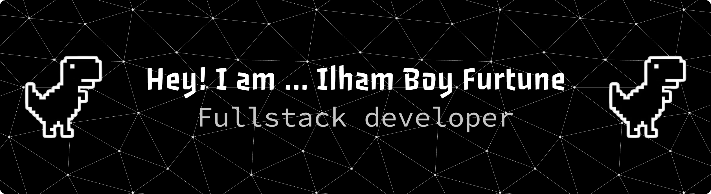

## Hello World I'm Ilhan Boy Furtune 👋

## 🌐 Socials:
              

# 💻 Tech Stack:

  
  
  
  
  
  
  
  
  
  
  
  
  
  
  
  
  
  
  
  
  

###

###

<picture>
  <source media="(prefers-color-scheme: dark)" srcset="https://raw.githubusercontent.com/ilhamboyfurtune/ilhamboyfurtune/output/pacman-contribution-graph-dark.svg">
  <source media="(prefers-color-scheme: light)" srcset="https://raw.githubusercontent.com/ilhamboyfurtune/ilhamboyfurtune/output/pacman-contribution-graph.svg">
  
</picture>

###

  

###

  

___

###
# 📊 GitHub Stats:
 
 

---

### ✍️ Random Dev Quote

---

  ## 💰 You can help me by Donating
    

  
<!-- Proudly created with GPRM ( https://gprm.itsvg.in ) -->

  

###
